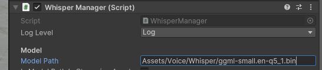

# VR Network Visualization

## Equipment

These are the tools used at our time of development, and by no means are hard requirements (e.g. you can use MacOS instead of Windows, but setup may differ).
- Unity 2022.3.62f2
- Oculus Rift/Quest
- Windows 11
- Windows Subsystem Linux 2
- python3.10

## Setup

1. Install Neo4J.
    - Go to their [download page](https://neo4j.com/deployment-center/#gdb-tab)
    - Scroll down to the section `Neo4j Desktop`
    - Select `Windows`
    - Click `Download`
    

2. Set up language server.
    - Go to folder `Assets/Voice/PythonScripts`
    - Run `install.sh`

## Running

1. Run Neo4J server.

2. Run language server.
    - Go to folder `Assets/Voice/PythonScripts`
    - Run `run.sh`

3. Click `Play` in Unity.

## Notes

- **Changing language model**: You can change the language model by downloading any model from [whisper's repo](https://huggingface.co/ggerganov/whisper.cpp/tree/main). Then, within Unity, go to the game object `===VOICE===/Whisper` and change the `Model Path` variable into the path of the new model. See screenshot below for an example.

